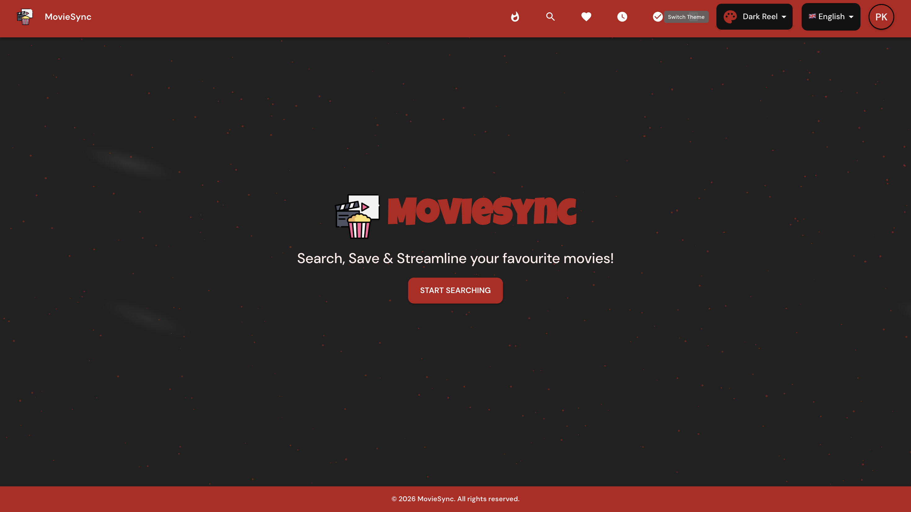
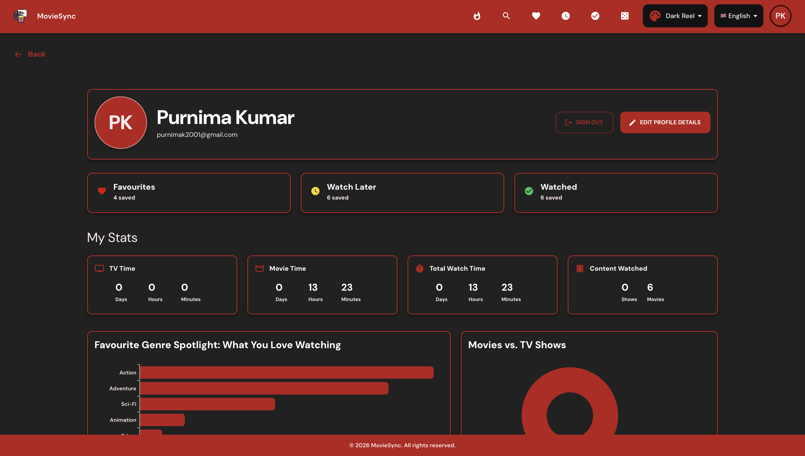
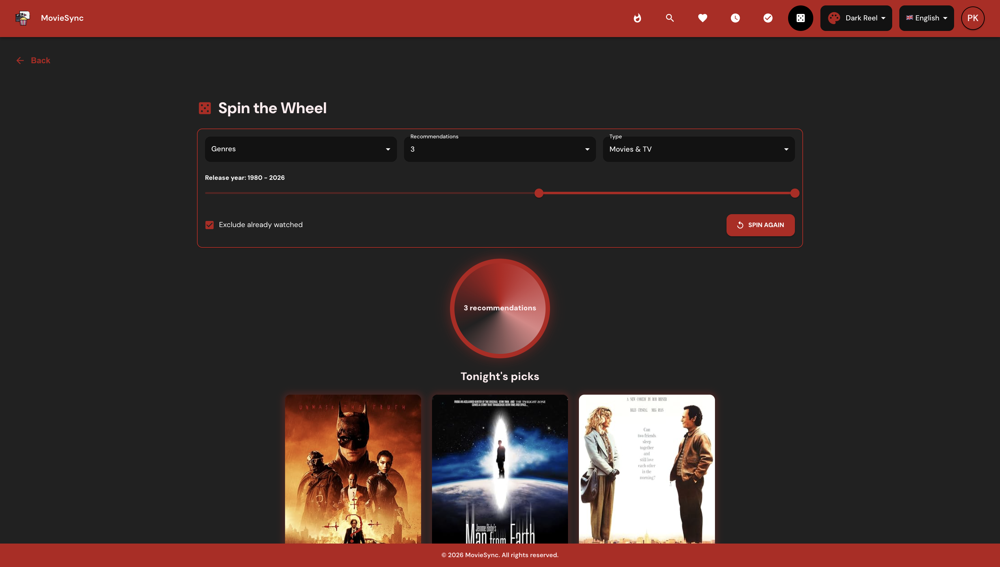
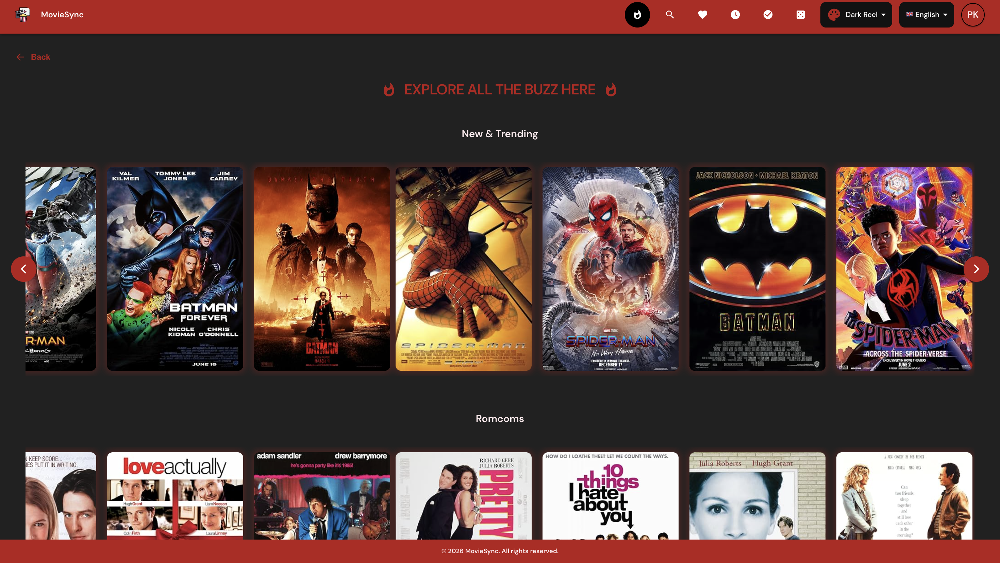
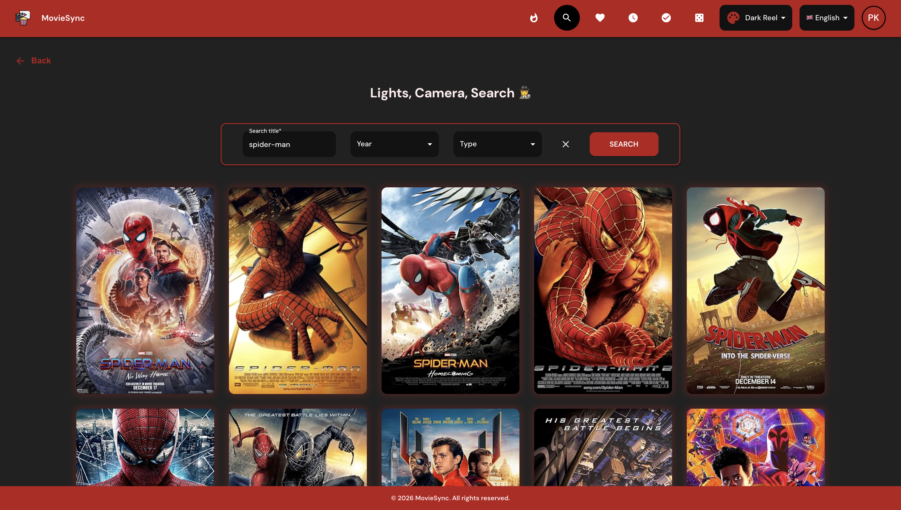
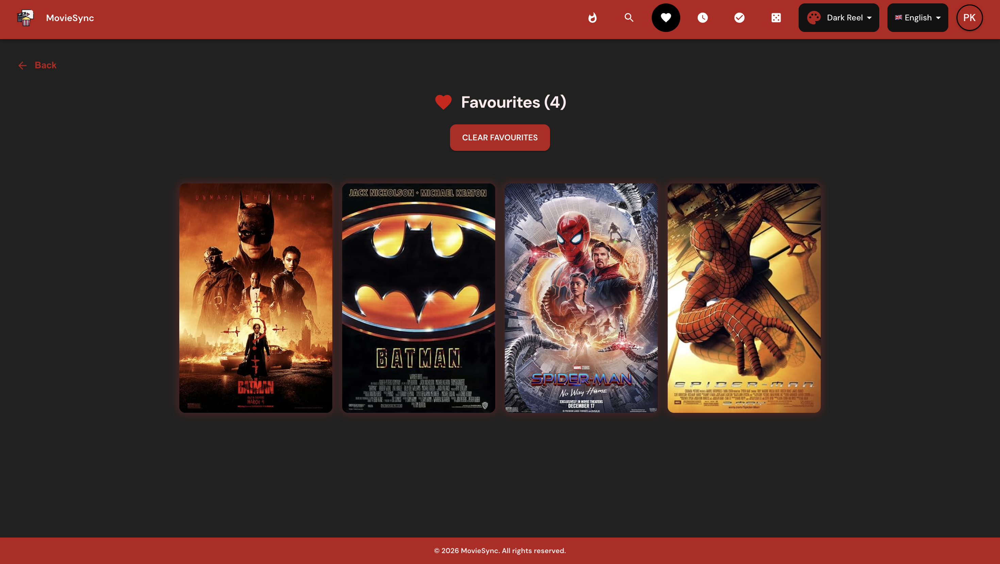
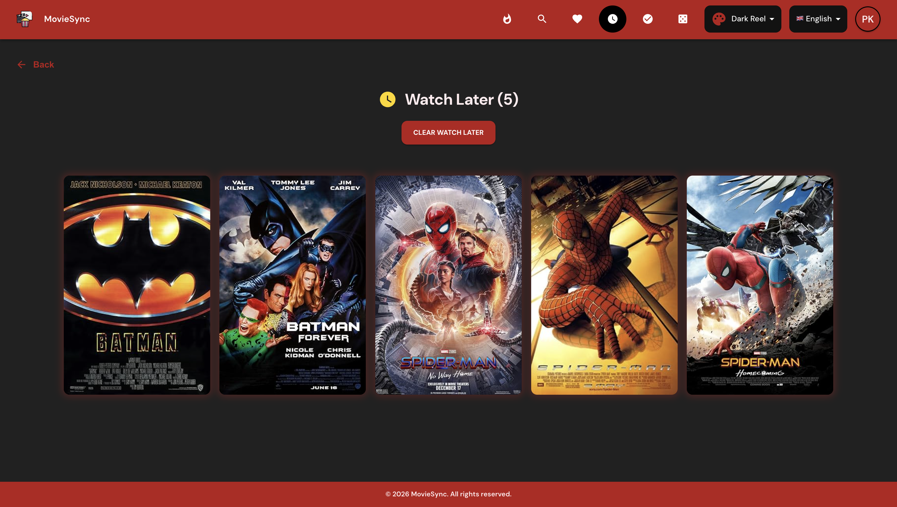
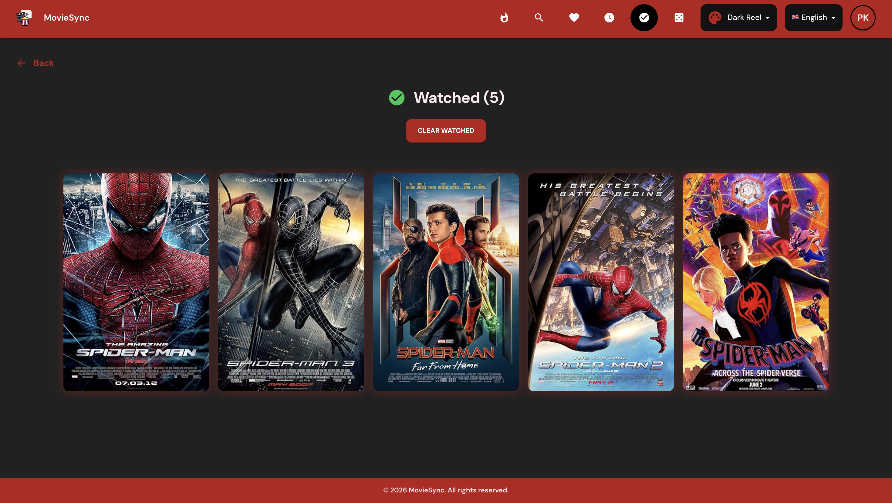

# MovieSync

**MovieSync** is a full-stack movie tracking application that I built while learning React and full-stack web development.

The idea is simple: search for movies, explore their details, and keep track of the movies you want to watch, have already watched, or want to save as favourites.

This started as a learning project during my internship and gradually grew into a more complete application with authentication, a backend API, a PostgreSQL database, user profiles, movie statistics, and a few fun features such as a movie recommendation spin wheel.

**Live application:** [MovieSync](https://moviesync-xi.vercel.app)

---

## Project Preview



---

## What can I do with MovieSync?

MovieSync is built around the idea of having one place to manage your personal movie collection.

### Search and explore movies

- Search for movies using the OMDb API
- View movie information such as title, poster, genre, plot, ratings, cast, and other available details
- Open a dedicated page for an individual movie
- Browse featured movies

### Keep track of movies

Once logged in, a user can organize movies into different lists:

- **Favourites** – movies you really like
- **Watch Later** – movies you want to watch in the future
- **Watched** – movies you have already watched

This makes the application more useful than a simple movie search page because users can build and manage their own movie collection.

### User profile and statistics

The profile section brings the user's movie activity together in one place.

It includes information and visual statistics based on the movies saved by the user, giving them a quick overview of their movie-watching habits.



### Movie recommendation spin wheel

Sometimes you know you want to watch something but cannot decide what.

MovieSync includes a **Spin Wheel** that can randomly pick movies from the user's saved collection. The user can choose how many recommendations they want and let the wheel decide.



### Authentication

MovieSync supports user authentication and keeps personal movie lists associated with the logged-in user.

The authentication implementation has evolved during development. The current frontend uses an **OpenID Connect (OIDC)** based authentication flow through `react-oidc-context`.

### Multiple languages

The application also includes internationalization using **i18next** and **react-i18next**, allowing the interface to support multiple languages.

---

# Screenshots

## Featured Movies

<!-- Add image here -->



## Search



<!-- ## Movie Details

 -->

## Favourites

<!-- Add image here -->



## Watch Later

<!-- Add image here -->



## Watched Movies

<!-- Add image here -->



## User Profile

<!-- Add image here -->


## Movie Spin Wheel

<!-- Add image here -->


---

# A simplified view of the application

```text
                 ┌─────────────────────┐
                 │      MovieSync      │
                 │   React Frontend    │
                 └──────────┬──────────┘
                            │
                 API requests / responses
                            │
                 ┌──────────▼──────────┐
                 │    Express API      │
                 │   Node + TypeScript │
                 └───────┬───────┬─────┘
                         │       │
              ┌──────────▼─┐   ┌▼─────────────┐
              │ PostgreSQL │   │    OMDb API  │
              │  Database  │   │ Movie data   │
              └────────────┘   └──────────────┘
```

The frontend handles the user interface and application state. The backend provides API endpoints and handles database operations, while the OMDb API provides movie information.

---

# Tech Stack

MovieSync has a separate frontend and backend.

## Frontend

- **React 19** – building the user interface
- **TypeScript** – type-safe development
- **Vite** – development server and build tool
- **Material UI (MUI)** – UI components and styling
- **React Router** – application routing
- **Redux Toolkit** – managing application state
- **Redux Persist** – persisting selected Redux state
- **Axios** – making API requests
- **React i18next / i18next** – internationalization
- **Formik + Yup** – forms and validation
- **MUI X Charts** – charts and statistics
- **Framer Motion** – animations
- **Embla Carousel / Swiper / React Slick** – carousels and sliders

## Backend

- **Node.js** – server-side JavaScript runtime
- **Express** – REST API framework
- **TypeScript** – type-safe backend development
- **PostgreSQL** – relational database
- **node-postgres (`pg`)** – PostgreSQL connection and queries
- **JWT / JWKS** – authentication token verification
- **Axios** – external API communication
- **Express Rate Limit** – basic API rate limiting
- **Swagger** – API documentation
- **Nodemon** – development workflow

## External services

- **OMDb API** – movie information and search
- **PostgreSQL database** – storing user and movie-related data
- **Vercel** – frontend deployment

---

### React and frontend development

- Building reusable React components
- Managing local and global state
- Creating custom hooks
- Using Redux Toolkit for application state
- Working with React Router and nested routes
- Handling asynchronous API calls
- Creating loading and error states
- Building reusable forms and validation
- Creating responsive layouts
- Working with charts and visualizations
- Adding animations and interactive UI elements

### Full-stack development

- Connecting a React frontend to an Express backend
- Designing REST API endpoints
- Structuring controllers, routes, and middleware
- Connecting Node.js to PostgreSQL
- Writing database queries
- Managing user-specific data
- Handling authentication tokens
- Protecting API endpoints
- Handling CORS and rate limiting
- Documenting APIs with Swagger

### Working with external APIs

The project uses the OMDb API for movie data. This helped me understand how to work with third-party APIs, transform API responses, handle missing data, and build a UI around data that I do not control.

### Deployment

I also used the project to learn about deploying a full-stack application, configuring environment variables, handling production builds, and troubleshooting issues that only appear after deployment.

---

# Some interesting implementation areas

## State management with Redux Toolkit

MovieSync has several pieces of state that need to be shared across different parts of the application, such as:

- User information
- Favourites
- Watch Later movies
- Watched movies
- Featured movies

Redux Toolkit is used to keep this state organized and make updates predictable.

## Authentication and user initialization

When an authenticated user enters the application, MovieSync initializes the corresponding user in the backend if required and then loads their saved movie lists.

This created a useful real-world example of connecting an authentication system with application-specific user data.

## Movie data and personal data are kept separate

The movie information comes from the OMDb API, while personal actions such as marking a movie as favourite or watched are stored in the application's PostgreSQL database.

This separation is useful because the application does not need to store an entire movie database of its own just to let users maintain personal lists.

---

# Learning Journey

MovieSync started as a project for learning React, but building it exposed me to much more than just React components.

The project evolved through several stages:

```text
React + TypeScript
        ↓
Vite
        ↓
React Router
        ↓
Redux Toolkit
        ↓
REST API integration
        ↓
Node.js + Express
        ↓
PostgreSQL
        ↓
Authentication
        ↓
Forms + validation
        ↓
Charts + statistics
        ↓
Internationalization
        ↓
Deployment
```

Each stage introduced a new problem to solve and helped me understand how the different pieces of a full-stack application fit together.

---

# Future Improvements

Some ideas I would like to explore as the project continues to evolve:

- Improve movie recommendations
- Add more personalized statistics
- Improve search and filtering
- Add more detailed movie and genre insights
- Improve mobile responsiveness
- Add automated frontend and backend tests
- Improve API documentation
- Continue improving the authentication flow
